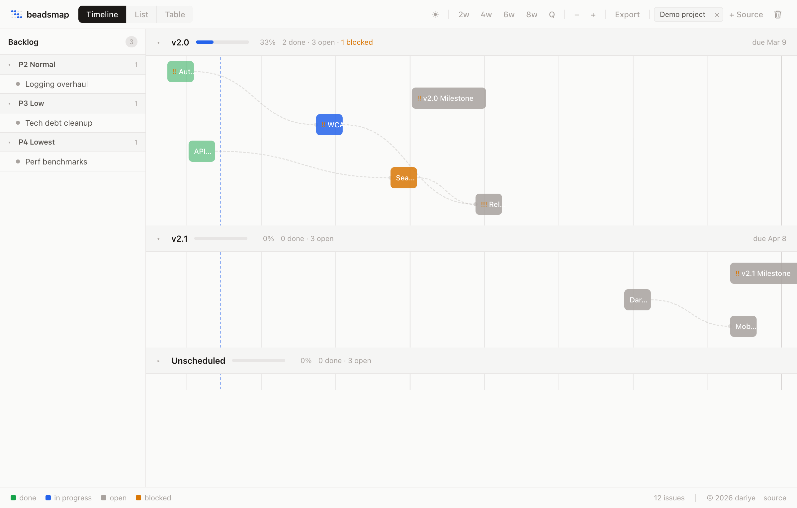
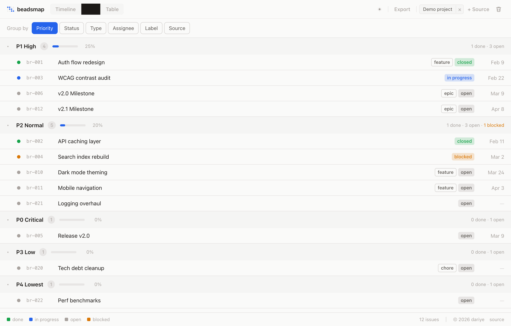
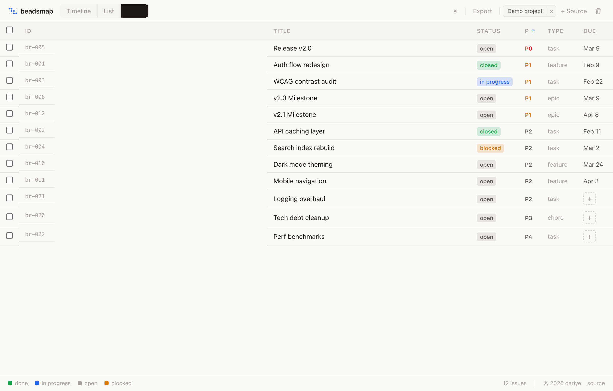
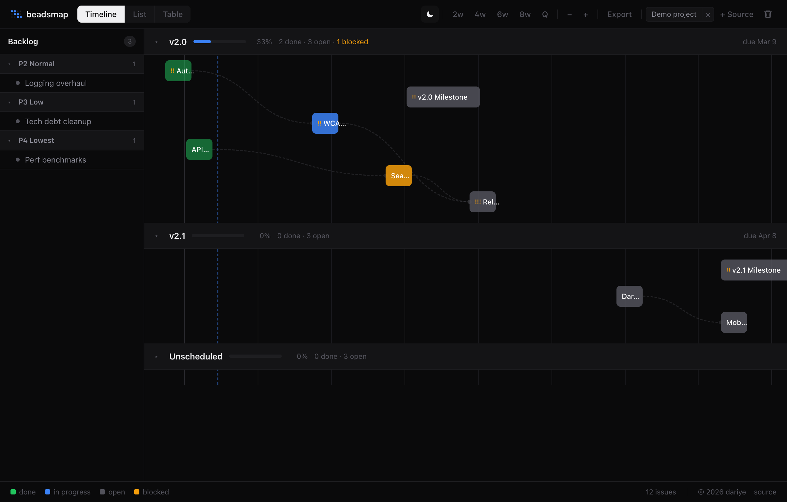
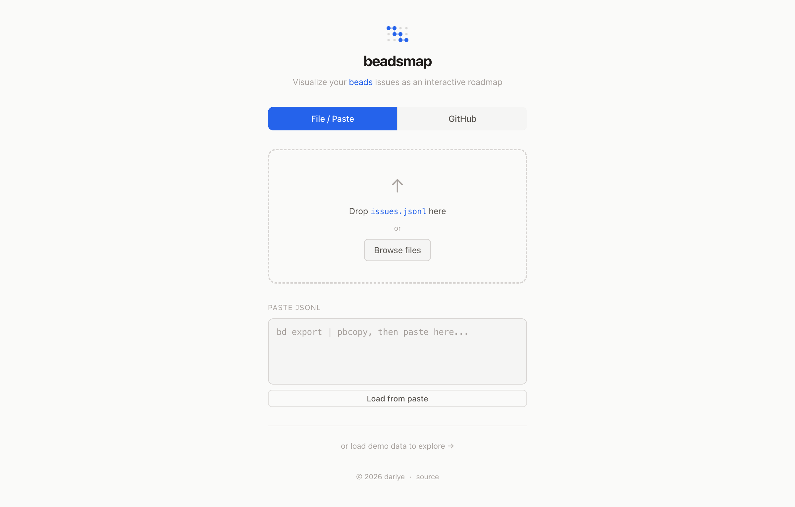

# beadsmap

Interactive roadmap visualization for [beads](https://github.com/steveyegge/beads) issues. Drop a `.jsonl` file, paste exported data, or connect to GitHub — see your project as a timeline, list, or table.



## Features

- **Timeline view** — Gantt-style chart with dependency arrows, milestones, and zoom controls
- **List view** — Group by priority, status, type, assignee, label, or source
- **Table view** — Sortable columns with inline status badges
- **Multi-source** — Load multiple projects and distinguish them with color-coded chips
- **GitHub integration** — Connect via OAuth device flow, load repos with `.beads/`, sync back
- **File / Paste input** — Drag-and-drop `.jsonl`, browse files, or paste `bd export` output
- **Light / Dark / System themes** — Warm stone palette with Linear-inspired polish
- **Single-file build** — Ships as one `index.html` via `vite-plugin-singlefile`

## Quick start

```bash
npm install
npm run dev
```

Open [http://localhost:5173](http://localhost:5173), then either:

1. **Paste** — run `bd export | pbcopy` and paste into the textarea
2. **File** — drop or browse for an `issues.jsonl`
3. **GitHub** — connect with an OAuth App + auth proxy (see below)
4. **Demo** — click "load demo data" on the landing page

## GitHub connection

beadsmap uses the [GitHub device flow](https://docs.github.com/en/apps/oauth-apps/building-oauth-apps/authorizing-oauth-apps#device-flow) through a Cloudflare Worker proxy that keeps your client secret server-side.

1. Deploy the auth proxy (`proxy/worker.js`) to Cloudflare Workers
2. Create a [GitHub OAuth App](https://github.com/settings/applications/new) with **Device Flow** enabled
3. Enter the proxy URL and Client ID in the app

## Build

```bash
npm run build        # outputs dist/index.html (single file)
npm run preview      # preview the production build
npm run check        # type-check Svelte + TypeScript
```

## Tech stack

- [Svelte 5](https://svelte.dev/) with runes (`$state`, `$derived`, `$effect`)
- [Vite](https://vite.dev/)
- [Tailwind CSS v4](https://tailwindcss.com/)
- TypeScript

## Screenshots

| List view | Table view |
|-----------|------------|
|  |  |

| Dark mode | Landing page |
|-----------|--------------|
|  |  |

## Contributing

Found a bug or want to add a feature? Open an issue or PR on [GitHub](https://github.com/dariye/beadsmap).

## License

[MIT](LICENSE) — built by [dariye](https://paul.dariye.com)
